# EV Fleet Optimization Studio


<div align="center">


*A comprehensive platform for EV fleet research, optimization, and prototyping in the San Francisco Bay Area*

</div>

---

## 🎯 Project Overview

The **EV Fleet Optimization Studio** is a platform that combines physics-based energy modeling, machine learning consumption prediction, and advanced routing algorithms to optimize electric vehicle fleet operations. Built specifically for the San Francisco Bay Area, this system provides end-to-end workflow orchestration for EV fleet research and prototyping.

### Key Innovation Areas
- **Physics-Based Energy Modeling**: Advanced thermodynamic and aerodynamic calculations
- **ML-Powered Route Optimization**: Predictive consumption models for intelligent routing
- **State-of-Charge (SOC) Planning**: Battery-aware routing with charging optimization
- **Synthetic Fleet Generation**: Realistic EV fleet simulation with behavioral modeling

---

## 📋 Table of Contents


- [🎯 Project Overview](#-project-overview)
- [🚀 Installation & Quick Start](#-installation--quick-start)          
- [📈 Interactive Dashboard Workflow](#-interactive-dashboard-workflow)  
- [⚙️ Core Features](#️-core-features)
- [📊 Energy Modeling](#-energy-modeling)                               
- [🏭 Synthetic Dataset Generation](#-synthetic-dataset-generation)
- [🤖 Machine Learning Pipeline](#-machine-learning-pipeline)
- [🗺️ Multi-Objective Optimization Framework](#️-multi-objective-optimization-framework)  
- [🔋 Battery & Charging Optimization](#-battery--charging-optimization)
- [🎬 Demo & Screenshots](#-demo--screenshots)
- [⚡ Performance Optimizations](#-performance-optimizations)
- [🔧 Advanced Configuration](#-advanced-configuration)
- [🚀 Future Improvements](#-future-improvements)           
---

## 🚀 Installation & Quick Start

### Prerequisites
- Python 3.8+ or Docker Desktop
- 16GB+ RAM recommended
- Internet connection (for OSM data download)

### Option 1: 🐳 Docker Deployment

```bash
# Clone and launch
git clone https://github.com/your-username/ev-fleet-optimization.git
cd ev-fleet-optimization

# Build and run
docker-compose up --build

# Access dashboard: http://localhost:8501
```
### Container Health Check
- Health endpoint: `http://localhost:8501/_stcore/health`
- Container logs: `docker-compose logs -f`

### Option 2: Local Environment

```bash
# Clone and setup
git clone https://github.com/your-username/ev-fleet-optimization.git
cd ev-fleet-optimization

# Install and launch
pip install -r requirements.txt
streamlit run app/streamlit_app.py
```


## 📈 Interactive Dashboard Workflow

The **Streamlit Dashboard** is the central command center for your EV fleet optimization workflow. Access all functionality through an intuitive web interface:

### 🎛️ **Configuration Studio**
Configure fleet parameters, optimization strategies, and infrastructure settings through interactive forms:
- **Fleet Composition**: Vehicle models, driver profiles, geographic regions
- **Charging Infrastructure**: Home/public charging availability and power settings
- **Optimization Strategy**: Multi-objective trade-offs (energy, cost, time)
- **Advanced Settings**: Planning horizons, battery reserves, algorithm selection


### 🏭 **Data Generation Pipeline**
Generate comprehensive synthetic fleet datasets with real-time monitoring:
- **Network Building**: Automatically download and process OSM road networks for realistic routing.
- **Fleet Simulation**: Create diverse EV fleets with market-based vehicle models and behavioral profiles
- **Physics-Based Routing**: Generate realistic GPS trajectories with elevation-aware energy modeling
- **Charging Behavior**: Simulate home/public charging patterns with behavioral personalities

### 🧠 **Model Training Center**
Train and evaluate ML models with interactive controls:
- **Algorithm Selection**: Random Forest, XGBoost, LightGBM, CatBoost
- **Performance Monitoring**: Real-time training metrics and feature importance
- **Model Comparison**: Side-by-side performance analysis
- **Automated Training**: Background processing with progress tracking

### 🚗 **Fleet Optimization Engine**
Run comprehensive fleet optimization with customizable parameters:
- **Route Optimization**: Energy-aware, cost-conscious, or time-critical routing
- **SOC Planning**: Battery-aware routing with charging station integration
- **Performance Analysis**: Before/after optimization comparison
- **Interactive Maps**: Visualize optimized routes and charging stations

### 📊 **Analytics & Visualization**
Comprehensive analysis and reporting tools:
- **Performance Dashboards**: Fleet KPIs, efficiency metrics, cost analysis
- **Interactive Maps**: Route visualization, charging station usage, energy heatmaps
- **Data Quality**: Dataset statistics, validation, and quality scoring
- **Export Capabilities**: Download results, reports, and optimized routes

---

## ⚙️ Core Features

### 🔬 **Physics-Based Energy Modeling**
- **Aerodynamic Drag**: Real-time air density correction with weather
- **Rolling Resistance**: Temperature and road condition adjustments  
- **Elevation Changes**: Precise grade calculations with regenerative braking
- **HVAC Systems**: Climate control energy consumption modeling
- **Battery Thermal Dynamics**: Temperature-dependent capacity and resistance

### 🧠 **Machine Learning Consumption Prediction**
- **Multiple Algorithms**: Random Forest, XGBoost, LightGBM, CatBoost
- **Feature Engineering**: 15+ engineered features from GPS, weather, vehicle data
- **Leakage Prevention**: Strict validation to prevent look-ahead bias
- **Real-time Inference**: Sub-millisecond prediction for routing applications

### 🗺️ **Multi-Objective Route Optimization**
- **Energy-Aware Routing**: Dijkstra and A* with ML-powered energy weight functions
- **Cost-Aware Planning**: Dynamic electricity pricing and charging cost optimization
- **Time-Sensitive Routing**: Configurable time vs energy vs cost trade-offs
- **SOC-Aware Navigation**: Battery state planning with charging station integration
- **Multi-Modal Optimization**: Simultaneous energy, cost, and time objectives

### 🔋 **Intelligent Charging Management**
- **Home vs Public Charging**: Behavioral modeling with cost optimization
- **Dynamic Pricing**: Time-of-use electricity rates and demand charges  
- **Station Selection**: Power rating, location, and cost-based decisions
- **Linear Programming**: Optimal charging schedules via LP solvers

---


## 📊 Energy Modeling

### Physics-Based Consumption Calculation

The `AdvancedEVEnergyModel` implements comprehensive vehicle dynamics:

```python
# Core energy components per segment
energy_components = {
    'rolling_resistance': C_r * m * g * cos(θ) * distance,
    'aerodynamic_drag': 0.5 * ρ * C_d * A * v_rel² * distance,
    'elevation_change': m * g * sin(θ) * distance,
    'acceleration': 0.5 * m * (v_f² - v_i²),
    'hvac': P_hvac * time_delta,
    'auxiliary': P_aux * time_delta,
    'battery_thermal_loss': I² * R(T) * time_delta
}
```

### Temperature-Dependent Battery Modeling
```python
# Battery internal resistance temperature dependence
R(T) = R_0 * exp(E_a/R * (1/T - 1/T_ref))

# Effective capacity correction
C_eff = C_nom * (T/T_ref)^α
```

### Key Physics Constants
- **Rolling Resistance**: 0.008 (baseline)
- **Air Density**: 1.225 kg/m³ (with temperature/humidity correction)  
- **Drivetrain Efficiency**: Motor(0.9) × Inverter(0.95) × Transmission(0.98)
- **Regenerative Braking**: Speed-dependent efficiency (max 0.85)

---


## 🏭 Synthetic Dataset Generation

### Ground Truth Data Pipeline

The `SyntheticEVGenerator` creates physics-driven, behaviorally-rich datasets for the San Francisco Bay Area, serving as ground truth for ML training and optimization benchmarking.

#### **Why San Francisco Bay Area?**
- **High EV Adoption**: Realistic market penetration and charging infrastructure
- **Diverse Terrain**: Hills, bridges, urban/suburban mix for elevation-aware modeling  
- **Complex Network**: Multi-modal connectivity with realistic routing challenges
- **Rich Public Data**: OSM road networks, weather patterns, charging stations

### Core Generation Components

#### **NetworkDatabase with Spatial Indexing**
```python
class NetworkDatabase:
    """OSM-derived road network with KDTree for efficient spatial queries"""
    
    def __init__(self):
        self.graph = self._load_or_build_network()
        self.kdtree = self._build_spatial_index()  # Fast nearest-node lookup
        self.elevation_cache = {}                   # Terrain elevation cache
    
    def get_nearest_node(self, lat: float, lon: float) -> int:
        """O(log n) spatial query via KDTree"""
        return self.kdtree.query([[lat, lon]])[1][0]
```

#### **Elevation Simulation**
```python
def _generate_elevation_profile(self, route_coords: List[Tuple]) -> List[float]:
    """Generate realistic Bay Area elevation with smoothing"""
    elevations = [self._sample_terrain_elevation(lat, lon) for lat, lon in route_coords]
    
    # Apply Savitzky-Golay filter to remove elevation noise
    if len(elevations) >= 5:
        smoothed = savgol_filter(elevations, window_length=11, polyorder=2)
        return smoothed.tolist()
    return elevations
```

### Behavioral Modeling Framework

#### **Driver Profiles & Personalities**
```python
DRIVER_PROFILES = {
    'commuter': {'trips_per_day': 2.1, 'long_trip_probability': 0.1},
    'rideshare': {'trips_per_day': 8.5, 'urban_bias': 0.8},
    'delivery': {'trips_per_day': 12.0, 'commercial_routes': True},
    'casual': {'trips_per_day': 1.5, 'weekend_factor': 2.0}
}

CHARGING_PERSONALITIES = {
    'anxious': {'charge_threshold': 0.6, 'target_soc': 0.95},
    'optimizer': {'charge_threshold': 0.3, 'off_peak_preference': 0.8},
    'convenience': {'public_charging_tolerance': 0.9},
    'procrastinator': {'charge_threshold': 0.15, 'emergency_charging_rate': 0.1}
}
```

#### **Market-Based Vehicle Distribution**
```python
EV_MODELS_MARKET_SHARE = {
    'tesla_model_3': 0.35,    # 75kWh, 18.1 kWh/100km
    'tesla_model_y': 0.20,    # 82kWh, 19.3 kWh/100km  
    'nissan_leaf': 0.15,      # 62kWh, 17.0 kWh/100km
    'chevrolet_bolt': 0.15,   # 65kWh, 16.9 kWh/100km
    'ford_mustang_mach_e': 0.10, # 88kWh, 20.5 kWh/100km
    'volkswagen_id4': 0.05    # 77kWh, 19.0 kWh/100km
}
```

### Dataset Schema & Quality

#### **Generated CSV Outputs**
- **routes.csv**: Per-trip energy consumption with context (15+ columns)
- **segments.csv**: Per-segment GPS traces with energy breakdown (25+ columns)  
- **charging_sessions.csv**: Home/public charging events with behavioral triggers
- **fleet_info.csv**: Static vehicle characteristics and driver assignments
- **weather.csv**: Daily Bay Area weather with seasonal patterns
- **vehicle_states.csv**: Daily aggregated fleet performance metrics


### Performance & Scalability

#### **Efficient Spatial Operations**
- **KDTree Indexing**: O(log n) nearest-node queries for GPS-to-network mapping
- **Elevation Caching**: Terrain lookups cached by geographic grid cells
- **Batch Processing**: Vectorized energy calculations for route segments

#### **Memory Management**
```python
class EfficientRouteGenerator:
    def __init__(self, cache_size=10000):
        self.route_cache = LRUCache(cache_size)
        self.elevation_cache = {}
        
    def generate_batch_routes(self, origin_dest_pairs: List[Tuple]) -> List[Route]:
        """Batch route generation with memory-efficient processing"""
        for batch in self._chunked_pairs(origin_dest_pairs, chunk_size=50):
            yield self._process_route_batch(batch)
```

---


---
## 🤖 Machine Learning Pipeline 

### Overview
The `SegmentEnergyPredictor` implements a **production-ready machine learning pipeline** for predicting **per-segment energy consumption** in EV fleets. The design emphasizes **no look-ahead bias** and **robust feature engineering**

### Model Architecture

#### Core Design Principles
- **Segment-level predictions**: Each route segment is modeled independently
- **No look-ahead bias**: Only pre-segment information is used
- **Ensemble-ready**: Multiple algorithms (tree-based + linear baselines) supported

#### Class Structure: SegmentEnergyPredictor
```python
class SegmentEnergyPredictor:
    """ML pipeline for per-segment EV energy prediction (kWh/km)."""

    models = {
        'linear_regression': LinearRegression(),
        'random_forest': RandomForestRegressor(n_estimators=200, random_state=42),
        'xgboost': XGBRegressor(n_estimators=300, tree_method="hist"),
        'lightgbm': LGBMRegressor(n_estimators=300),
        'catboost': CatBoostRegressor(iterations=300, verbose=0)
    }
```

### Feature Engineering

The feature pipeline transforms raw fleet, segment, and weather data into **bias-free predictive features**.

#### 1. Core Features

**Spatial:**
- `start_lat`, `start_lon`, `start_elevation_m`, `heading`
- `elevation_gain` 
- `log_distance_m`

**Temporal:**
- `hour`, `weekday`,`season`

**Environmental:**
- `weather_temp_c`, `weather_wind_kmh`, `weather_humidity`
- `wind_speed_kmh`, `humidity`

**Behavioral and personal + vehicule specific :**

- `model`, `efficiency`(historical)
- `driver_profile`, `driver_personality`
- `distance_bin_encoded`
- `driving_style_encoded`

### Training Pipeline

```python
def train_models():
    # 1. Load & join datasets
    segments = load_segments()
    fleet_info = load_fleet_info()
    weather = load_weather()
    
    # 2. Feature engineering
    features_df = engineer_features(segments, fleet_info, weather)
    
    # 3. Prepare target (log-transformed energy per km)
    target = np.log1p(features_df["energy_per_km"])
    
    # 4. Train/val/test split
    X_train, X_test, y_train, y_test = train_test_split(
        features_df, target, test_size=0.2, random_state=42
    )
    X_train, X_val, y_train, y_val = train_test_split(
        X_train, y_train, test_size=0.25, random_state=42
    )  # 60/20/20
    
    # 5. Train ensemble models with hyperparam tuning
    for name, model in SegmentEnergyPredictor.models.items():
        tuned_model = tune_model(model, X_train, y_train, X_val, y_val)
        evaluate_model(tuned_model, X_test, y_test)
    
    # 6. Save model bundle (models, encoders, scalers, schema)
    save_model_bundle(models, encoders, scalers, feature_columns)
```

### Hyperparameter Optimization

- **XGBoost**: Tuned via **Optuna** (30–100 trials, MAE minimized)
- **Others (RF, LGBM, CatBoost)**: Tuned with **RandomizedSearchCV** (30 iterations, 3-fold CV)
- **Parallel Processing**: `n_jobs=-1` with threading backend

### Performance Metrics

All models are evaluated on validation and test sets using:
- **MAE** (Mean Absolute Error) → Primary optimization metric
- **RMSE** (Root Mean Squared Error) → Penalizes large errors
- **R2** (Explained variance)
- **MAPE** (Mean Absolute Percentage Error)
- **SMAPE** (Symmetric MAPE, handles zeros better)

### Model Persistence

Saved using **joblib** with:
- Trained models
- Feature schema
- Encoders & scalers
- Median values for missing handling
- Model performance metrics

---

## 🗺️ Multi-Objective Optimization Framework

The system implements sophisticated optimization that goes far beyond simple energy minimization:

```python
# Multi-objective cost function
total_cost = (
    energy_cost +                           # kWh consumption
    gamma_time_weight * time_cost +         # Time penalty (kWh/hour)
    alpha_usd_per_hour * travel_time +      # Time value (USD/hour)
    beta_kwh_to_usd * charging_cost         # Charging cost conversion
)
```

### Advanced Routing Algorithms

#### Energy-Aware Dijkstra with ML Weights
```python
def energy_optimal_route(graph, source, target, context):
    """Find minimum energy consumption path with ML predictions"""
    weight_function = EnergyWeightFunction(
        ml_model=segment_energy_predictor,
        vehicle_context=context.vehicle,
        weather_context=context.weather,
        cache_size=10000  # LRU cache for performance
    )
    return nx.shortest_path(graph, source, target, weight=weight_function)
```

#### SOC-Aware Resource Routing
```python
class SOCResourceRouter:
    """Battery-aware routing with charging integration"""
    
    objectives = {
        'energy': minimize_kwh_consumption,
        'cost': minimize_total_charging_cost,
        'time': minimize_travel_plus_charging_time,
        'weighted': multi_objective_optimization
    }
```

### Optimization Strategies

| Strategy | Description | Use Case |
|----------|-------------|----------|
| **Energy-First** | `soc_objective='energy'`, `gamma=0.01` | Maximum efficiency |
| **Cost-Conscious** | `soc_objective='cost'`, `price_weight=2.0` | Budget-sensitive fleets |
| **Time-Critical** | `soc_objective='time'`, `alpha_usd_per_hour=25` | Commercial delivery |
| **Balanced** | `soc_objective='weighted'`, custom weights | General fleet use |

### Planning Modes

```python
PLANNING_MODES = {
    'myopic': "Single-trip optimization",
    'next_trip': "Reserve energy for immediate next trip", 
    'rolling_horizon': "Multi-trip look-ahead planning"
}
```

### Performance Optimizations

#### Batched ML Predictions
- **Problem**: Individual edge predictions were expensive
- **Solution**: Batch multiple edges into single DataFrame predictions
- **Result**: 5-10x speedup in ML model calls

#### LRU Cache with Fixed Size
```python
class EnergyWeightFunction:
    def __init__(self, cache_size=10000):
        self.cache = LRUCache(cache_size)
    
    def __call__(self, u, v, edge_data):
        cache_key = (u, v, edge_data['key'], self.context_hash)
        if cache_key in self.cache:
            return self.cache[cache_key]
        
        energy = self._predict_energy(u, v, edge_data)
        self.cache[cache_key] = energy
        return energy
```

---

## 🔋 Battery & Charging Optimization

### State-of-Charge (SOC) Aware Routing

#### SOC Resource Router
```python
class SOCResourceRouter:
    """Battery-aware routing with charging integration"""
    
    def find_optimal_path(self, source, target, initial_soc):
        # State: (node, soc_level, path_cost)
        # Actions: drive_edge, charge_at_station
        
        state_space = self._build_state_space()
        return self._dynamic_programming_search(state_space)
```

#### Charging Decision Logic
```python
def should_charge(current_soc, remaining_distance, comfort_margin=0.2):
    """Intelligent charging decision making"""
    required_energy = estimate_energy_consumption(remaining_distance)
    available_energy = current_soc * battery_capacity
    
    return available_energy < (required_energy * (1 + comfort_margin))
```

### Linear Programming for Charging Optimization

```python
def optimize_charging_schedule_lp(path_segments, charging_stations, 
                                initial_soc, target_soc):
    """Minimize total charging time via LP"""
    
    # Decision variables: charge amount at each station
    charge_vars = [LpVariable(f"charge_{i}", 0, station.max_power) 
                  for i, station in enumerate(charging_stations)]
    
    # Objective: minimize total time
    objective = sum(charge_var / station.power_rating 
                   for charge_var, station in zip(charge_vars, stations))
    
    # Constraints: SOC balance, capacity limits
    constraints = build_soc_constraints(charge_vars, path_segments)
    
    return solve_lp(objective, constraints)
```

---

## 🎬 Demo & Screenshots


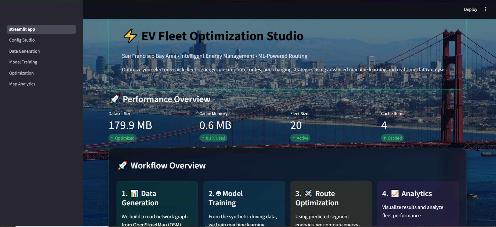
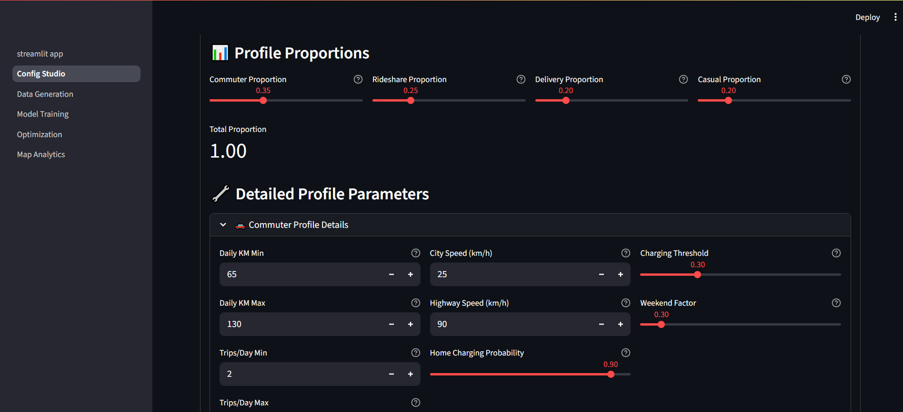
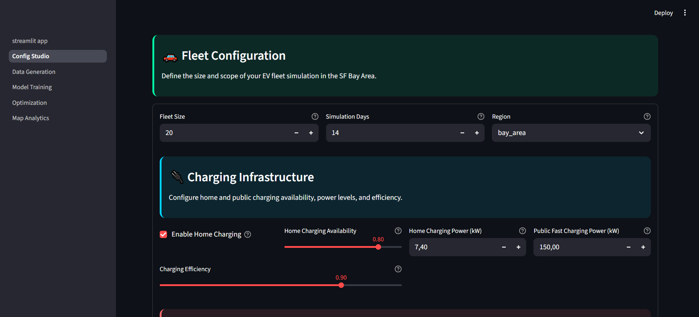
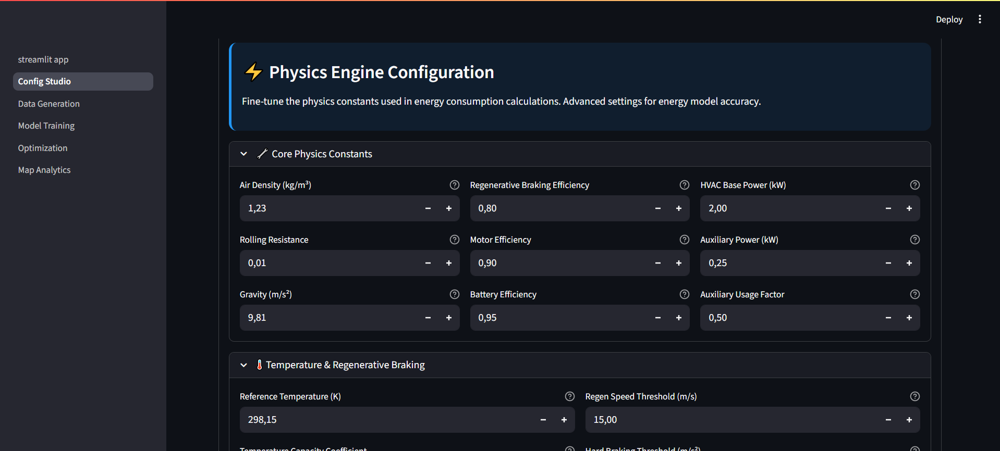
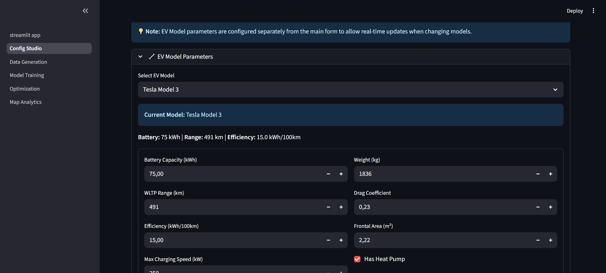
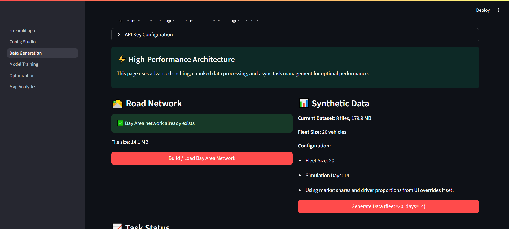
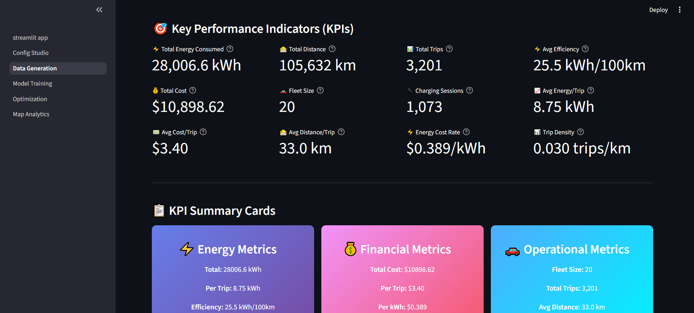
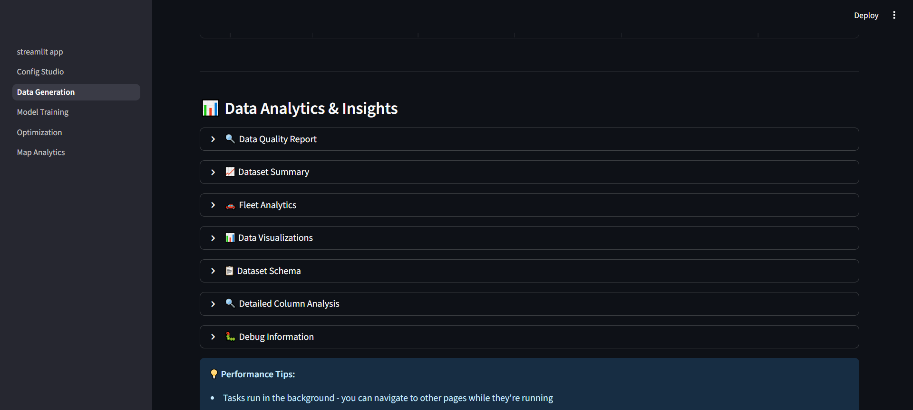
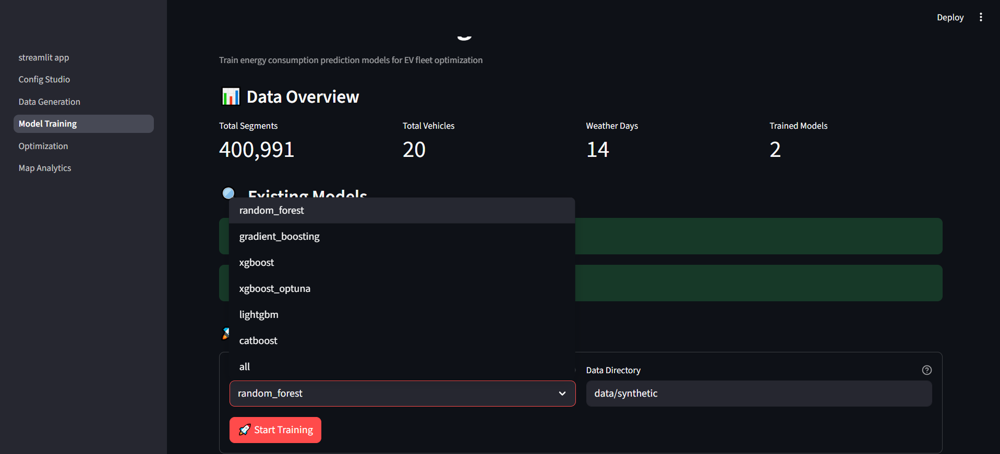
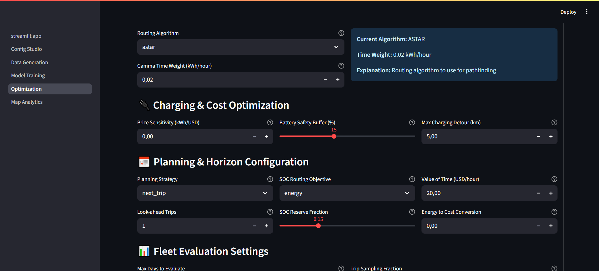
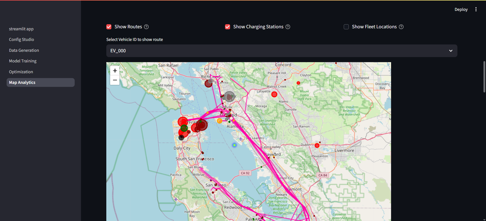
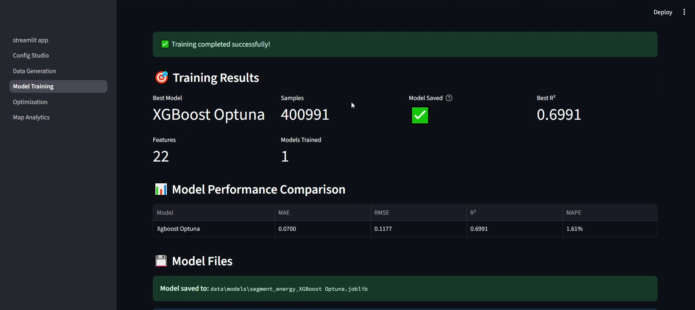
---

## ⚡ Performance Optimizations

### Routing Performance Improvements

| Optimization | Impact | Speedup |
|-------------|--------|---------|
| Batched ML Predictions | Reduced model calls | 5-10x |
| LRU Edge Weight Cache | Memory efficiency | 2-3x |  
| Custom A* Implementation | Better heuristics | 2-5x |
| NetworkX Fallback Strategy | Reliability | Robust |

### Memory Management
```python
# Smart caching strategy
class LRUCache:
    def __init__(self, capacity=10000):
        self.capacity = capacity
        self.cache = OrderedDict()
    
    def get(self, key):
        if key in self.cache:
            self.cache.move_to_end(key)  # Mark as recently used
            return self.cache[key]
        return None
    
    def put(self, key, value):
        if len(self.cache) >= self.capacity:
            self.cache.popitem(last=False)  # Remove least recent
        self.cache[key] = value
```

---

## 🔧 Advanced Configuration

### Core Optimization Parameters

```python
# Multi-objective routing configuration
OPTIMIZATION_CONFIG = {
    'route_optimization_algorithm': 'dijkstra',        # 'dijkstra' | 'astar' | 'custom_astar'
    'soc_objective': 'energy',                         # 'energy' | 'cost' | 'time' | 'weighted'
    'planning_mode': 'rolling_horizon',                # 'myopic' | 'next_trip' | 'rolling_horizon'
    
    # Trade-off weights
    'gamma_time_weight': 0.02,                         # kWh per hour time penalty
    'alpha_usd_per_hour': 0.0,                         # Value of time (USD/hour)
    'beta_kwh_to_usd': 0.15,                          # Energy cost conversion
    'price_weight_kwh_per_usd': 2.0,                   # Cost sensitivity factor
    
    # Planning horizon
    'horizon_trips': 3,                                # Look-ahead trip count
    'horizon_hours': 24.0,                            # Look-ahead time window
    'reserve_soc': 0.15,                              # Battery reserve (15%)
    'battery_buffer_percentage': 15                    # Safety margin
}
```

### Fleet Composition Configuration

```python
# EV model distribution (must sum to 1.0)
EV_MODELS_MARKET_SHARE = {
    'tesla_model_3': 0.35,
    'tesla_model_y': 0.20,
    'nissan_leaf': 0.15,
    'chevrolet_bolt': 0.15,
    'ford_mustang_mach_e': 0.10,
    'volkswagen_id4': 0.05
}

# Driver behavior distribution (must sum to 1.0)
DRIVER_PROFILES_PROPORTION = {
    'commuter': 0.50,     # Regular work commutes
    'rideshare': 0.20,    # Ride-sharing service
    'delivery': 0.20,     # Commercial delivery
    'casual': 0.10        # Personal/leisure use
}
```

### Charging Infrastructure Configuration

```python
CHARGING_CONFIG = {
    # Home charging
    'home_charging_availability': 0.8,     # 80% have home access
    'home_charging_power': 7.4,           # kW (Level 2)
    'home_charging_efficiency': 0.9,      # 90% efficiency
    
    # Public charging
    'public_fast_charging_power': 150.0,  # kW (DC Fast)
    'public_l2_charging_power': 22.0,     # kW (AC Level 2)
    'max_detour_for_charging_km': 5.0,    # Max detour distance
    
    # Pricing
    'home_electricity_price': 0.15,       # USD/kWh
    'public_charging_multiplier': 2.5,    # Price premium
    'peak_hour_multiplier': 1.5           # Peak pricing
}
```

### Performance and Evaluation Settings

```python
PERFORMANCE_CONFIG = {
    # Fleet evaluation limits (for faster testing)
    'fleet_eval_max_days': 0,             # 0 = all days
    'fleet_eval_trip_sample_frac': 1.0,   # 1.0 = all trips
    
    # Caching and performance
    'lru_cache_size': 10000,              # Edge weight cache
    'batch_prediction_size': 50,          # ML batch size
    'enable_physics_validation': True,     # Validate with physics model
    
    # Optimization thresholds
    'min_improvement_threshold': 0.01,     # 1% minimum improvement
    'max_optimization_time_minutes': 30   # Time limit per optimization
}
```

## 🚀 Future Improvements

### Performance Bottlenecks

#### **C++/Rust Migration for Core Algorithms**
Python's interpreted nature creates significant performance bottlenecks for large-scale optimization:


**Proposed Solutions:**
- **Rust Integration**: Rewrite core routing algorithms using `petgraph` crate
  - Expected speedup: 10-50x for large graphs
  - Memory efficiency: 60-80% reduction
  - Safe parallelization with `rayon` for multi-threaded optimization
  
- **C++ with Python Bindings**: Use `pybind11` for critical path operations
  - Leverage optimized graph libraries (GTSP, Boost Graph)
  - SIMD optimizations for distance/energy calculations
  - Custom memory pools for reduced allocation overhead


### Advanced Feature Engineering

#### **Deep Learning Feature Extraction**

My current feature engineering limit model expressiveness , 
proper feature engineering requires extensive testing 


**What I'd do differently with more time :**

1. **Graph Neural Networks (GNNs)**
   - Learn spatial relationships between road segments
   - Capture network topology effects on energy consumption
   - Message passing for multi-hop energy dependencies

2. **Temporal Embeddings**
   - Learnable time-of-day representations beyond categorical encoding
   - Seasonal patterns with Fourier features
   - Traffic flow predictions from historical patterns

3. **Multi-Scale Geographic Features**
   - Hierarchical spatial clustering (neighborhood → district → city)
   - Contextual features: nearby POIs, land use, traffic density
   - Dynamic features: real-time traffic, weather forecasts

4. **Synthetic Data generation improvement and the Need for Real-World Data Validation !**

### Scalability & Architecture Improvements

#### **Distributed Computing Framework**
Current single-machine limitations for large fleets :

**Proposed Architecture:**
- **Ray/Dask Cluster**: Distributed ML training and fleet optimization
- **Redis/Apache Kafka**: Real-time data streaming for live optimization  
- **PostgreSQL with PostGIS**: Efficient spatial queries and data persistence


### Advanced Optimization Techniques

#### **Multi-Objective Evolutionary Algorithms**
Beyond current weighted-sum approaches:

- **NSGA-II/NSGA-III**: Pareto-optimal solutions for energy vs time vs cost
- **Population-based search**: Escape local optima in complex route spaces
- **Dynamic programming with approximation**: Handle battery SOC state explosion

#### **Reinforcement Learning Integration**
Learn adaptive policies for different scenarios:

```python
# Future RL-based route optimization
class AdaptiveFleetAgent(PPO):
    def __init__(self):
        self.state_space = gym.spaces.Box(  # Fleet state representation
            low=-np.inf, high=np.inf, shape=(fleet_size * 10,))
        self.action_space = gym.spaces.Discrete(n_route_choices)
    
    def learn_policy(self, fleet_episodes):
        # Learn from historical fleet operations
        # Adapt to traffic patterns, seasonal changes, charging availability
        pass
```


---

<div align="center">

### 🚀 **Ready to Optimize Your EV Fleet?**

[Get Started](#-quick-start)

**Built with ❤️ for sustainable transportation**

</div>