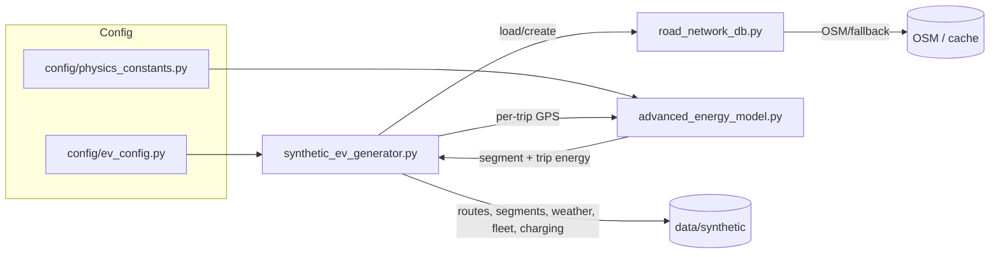

# EV Fleet Optimization - Synthetic Data Generation

## Overview

This subsystem synthesizes realistic EV fleet datasets for the San Francisco Bay Area, including GPS traces, per-segment physics, per-trip summaries, charging sessions, fleet metadata, and weather. It is the ground truth for training the ML consumption model and benchmarking routing/charging optimizers.

- **Physics-driven**: Consumption computed via `AdvancedEVEnergyModel` using aerodynamics, rolling resistance, elevation, HVAC, regen, and temperature effects
- **Network-realistic**: Routing over OSM-derived graphs with robust fallbacks in `NetworkDatabase`
- **Behaviorally rich**: Driver profiles, driving styles, personalities, and home/public charging choices
- **Scalable and reproducible**: Centralized config, caching, and deterministic seeds where applicable

## System architecture



## Why Bay Area?

- **High EV adoption**, diverse terrain/urbanicity, rich public data, complex connectivity (bridges, corridors), and realistic weather variability.

## Repository layout

```
src/data_generation/
├── synthetic_ev_generator.py    # Orchestrates generation, charging, exports
├── road_network_db.py           # Loads/builds/caches bay-area road graph
└── advanced_energy_model.py     # Physics-based segment energy model

config/
├── ev_config.py                 # Fleet, charging, weather, bounds
├── ev_models.py                 # Vehicle specs (weight, CdA, battery)
├── driver_profiles.py           # Profiles, style distributions
└── physics_constants.py         # Physics + battery params/curves

data/
├── synthetic/                   # CSV/Parquet outputs
└── networks/                    # Cached graphs (*.pkl.gz)
```

## Quick start

```
# Optional: OpenChargeMap key in .env (if using real stations)
OPENCHARGEMAP_API_KEY="..."

# Generate datasets
python src/data_generation/synthetic_ev_generator.py

# Output: data/synthetic/*.csv (+ optional parquet)
```

## Core components

- **`SyntheticEVGenerator`**: builds fleet, generates daily trips, samples destinations, constructs GPS traces with timing/elevation, calls `AdvancedEVEnergyModel`, simulates charging, exports datasets. See `docs/synthetic_ev_generator.md`.
- **`NetworkDatabase`**: loads/creates a bay-area `networkx.MultiDiGraph`; uses OSMnx when available, with merging, filtering, and synthetic bridges; caches and builds a KDTree for fast nearest-node queries. See `docs/road_network_db.md`.
- **`AdvancedEVEnergyModel`**: physics-based energy per segment with temp-dependent battery parameters and drivetrain losses; returns per-trip totals and optional per-segment breakdown. See `docs/advanced_energy_model.md`.

## Data contracts (CSV)

- **routes.csv** per trip
  - Required: `vehicle_id,trip_id,date,origin_lat,origin_lon,destination_lat,destination_lon,total_distance_km,total_consumption_kwh,efficiency_kwh_per_100km`
  - Context: `temperature_celsius,weather_is_raining,driver_profile,vehicle_model`

- **segments.csv** per route segment (if enabled)
  - `vehicle_id,trip_id,segment_id,start_time,end_time,start_lat,start_lon,end_lat,end_lon,start_speed_kmh,end_speed_kmh,start_elevation_m,end_elevation_m`
  - `distance_m,energy_kwh`
  - Energy breakdown columns: `energy_rolling_resistance_kwh,energy_aerodynamic_drag_kwh,energy_elevation_change_kwh,energy_acceleration_kwh,energy_regenerative_braking_kwh,energy_hvac_kwh,energy_auxiliary_kwh,energy_battery_thermal_loss_kwh`
  - Weather snapshot: `weather_temp_c,weather_wind_kmh,weather_is_raining,weather_humidity,season`
  - Feature provenance: all fields are pre-segment or external context; no realized post-segment leakage

- **charging_sessions.csv**
  - `vehicle_id,session_id,charging_type,start_time,end_time,energy_delivered_kwh,cost_usd,start_soc,end_soc,charging_power_kw,station_operator,connector_type,is_emergency_charging`

- **vehicle_states.csv** daily per vehicle
  - `vehicle_id,date,total_distance_km,total_consumption_kwh,num_trips,num_charging_sessions,driver_profile,vehicle_model,efficiency_kwh_per_100km`

- **weather.csv** daily
  - `date,temperature,is_raining,wind_speed_kmh,humidity,season`

- **fleet_info.csv** static per vehicle
  - `vehicle_id,model,battery_capacity,efficiency,max_charging_speed,driver_profile,driving_style,driver_personality,home_location_lat,home_location_lon,current_battery_soc,has_home_charging`

## Generation lifecycle

1) Fleet creation: sample model, battery, profile, style, home-charging, home location within bounds
2) Per-day: choose start hour, schedule variability, and number of trips per profile
3) For each trip:
   - Sample destination (home bias, corridors, long-trip triggers)
   - Route via `NetworkDatabase` or fallback straight-line with detour factor
   - Build GPS trace with speeds, elevations, and timestamps
   - Compute segment and trip energy via `AdvancedEVEnergyModel`
   - Decide and simulate charging sessions (home/public, thresholds, power, pricing)
4) Export CSV/Parquet with minimal NaNs and stable schemas

Parameter highlights and defaults:
- Fleet size/days/region from `FLEET_CONFIG`; depot and geographic bounds tuned to avoid ocean nodes
- Charging: home availability, L2/L3 power, peak hours and pricing multiplier, base kWh price
- Weather: base temp, seasonal amplitude, rain probability, wind/humidity typicals
- Routing: detour factors for fallback, speed maps per highway type, synthetic bridges thresholds (5–30 km)

## Fallbacks and safeguards

- Network: bbox → merged cities → state filter → comprehensive mock + synthetic bridges
- Energy: short-segment simplification, min/max efficiency clamps, non-zero floors
- Routing failures: direct-route fallback with physics validation

Data quality guards:
- Numeric coercions and dtype normalization before export
- Minimal nulls; defaults for missing speeds/elevations/timestamps
- Efficient per-component logging for diagnosing anomalies (see logging doc)

## Configuration highlights

- Fleet size/days/region, operating hours
- Charging enable/home availability/power, peak hours, base price
- Weather base temp, seasonal amplitude, rain probability, wind/humidity
- Geographic bounds tuned to avoid ocean/voids

See `config/ev_config.py` for authoritative values.

## Related documentation

- `docs/synthetic_ev_generator.md`
- `docs/road_network_db.md`
- `docs/advanced_energy_model.md`

